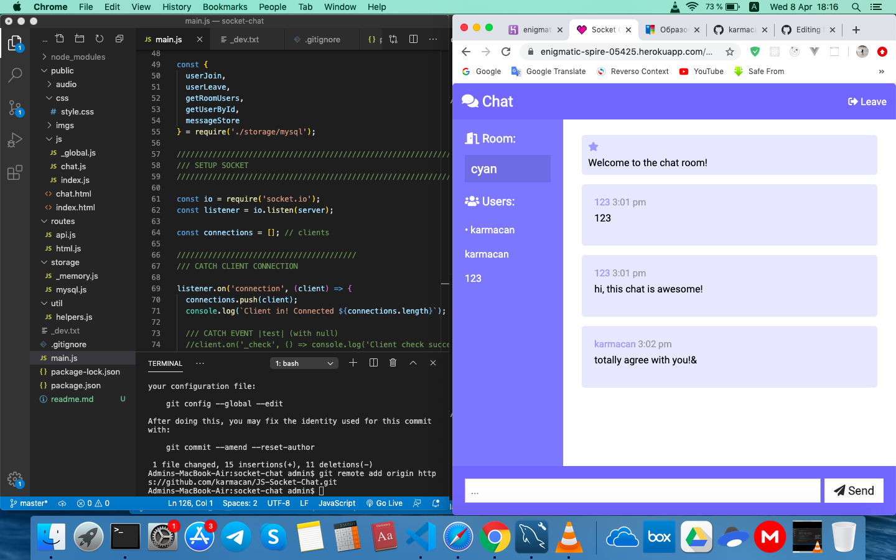

<h1>Socket Chat</h1>

# App Discription
It is a chat application aimed to clone popular chat application like WattsApp or Telegram. User can pick a name and proceed to chat room. Chat messages stored in database, so on other connection they reappear.

# Developement Base
Backend was written using tecknologies Node.js, Express.js & Socket.io. Frontend created with native HTML, CSS & JS. For deployment was used Heroku as hosting service and ClearDB for remote MySQL data storage.

# Repo Link
https://enigmatic-spire-05425.herokuapp.com/

# App Screens
